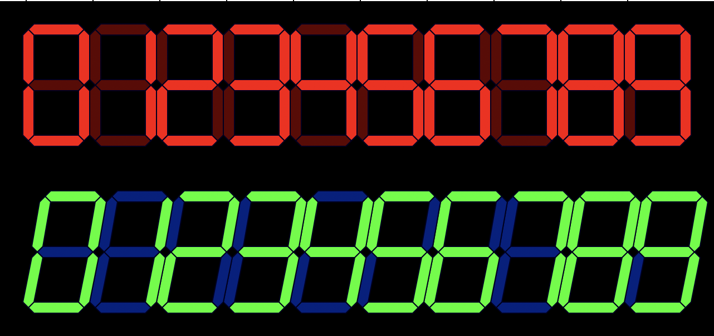
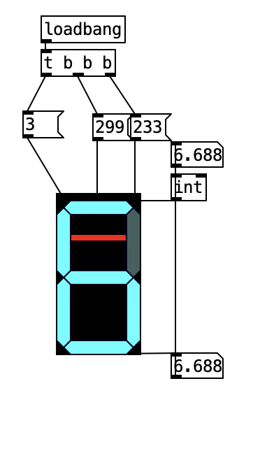

# LCD style number dials (in Pure Data Vanilla)
This project serves as an introduction in how to create visuals with data structures in pure data.
You can find the youtube tutorial [here](https://www.youtube.com/watch?v=v8sXrGUu2qg&lc=UgxCrIAxeZxmAsaQUAJ4AaABAg.A9PsmVbNqTXA9ZqqCcGKQ6).

You will find two example files containing the lcs objects: One for orthogonal numbers and one for slanted, _italic_ numbers.
If you place a vslider behind the number dial and connect it, you can use it as an interactive number field.

You fill find examples in the example.pd patch.